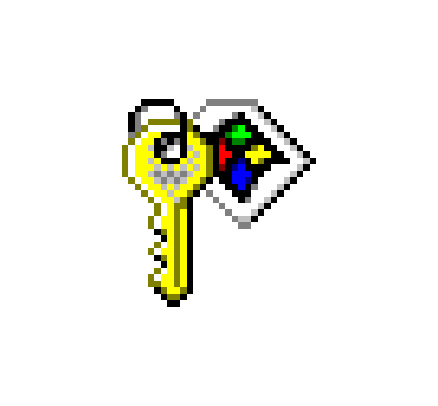
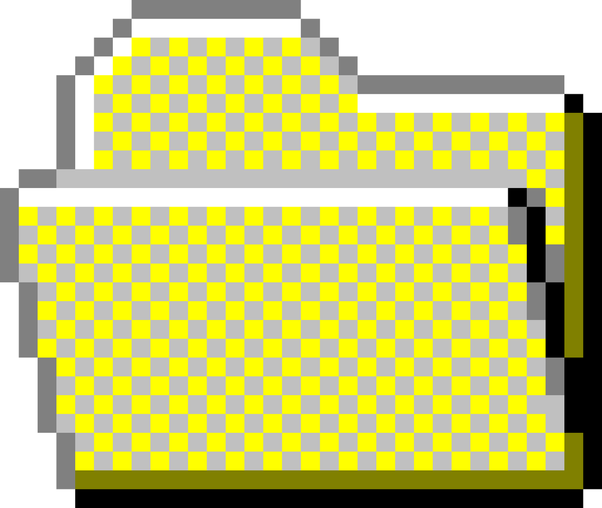
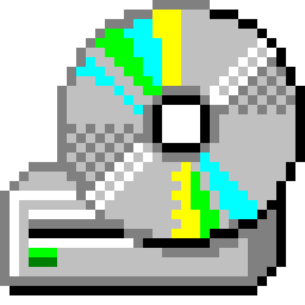

<!DOCTYPE html>
<html lang="en">

<head>
    <meta charset="UTF-8">
    <meta name="viewport" content="width=device-width, initial-scale=1.0">
    <title>Document</title>
    <link rel="stylesheet" href="style.css">
</head>

<body id="body-screen">

    
 Click anywhere to start Windows 95

    

        

        
 Loading... 

        

            
        

    

    

        
 Welcome to Windows 95
        

        
 Type a user name and a password to log on to Windows 95
        

        
 User name:
        

        

            <input id="login-username-input" type="text">
        

        
 Password:
        

        

            <input id="login-password-input" type="password">
        

        

            <button onclick="login_ok_button()" id="login-ok-button"> Ok</button>
        

        

            
        

    

    

        

        

        

        

            <button onclick="myFunctionBar()" id="button-start"> 
                 Start
            </button>
            
 klokke 

        

        

            

                

                

                    
                    
 Programs 

                    
 ▸

                

                

                    
                    
 Documents 

                    
 ▸

                

                

                    
                    
 CD 

                    
 ▸

                

                

                    
                    
 Find 

                    
 ▸

                

                

                    
                    
 Shut Down

                

            

        

        

            

                
                <button onclick="calculatorButtonX()" id="calculator-button-x"> x </button>
            

            <input id="display-calculator" readonly>

            

                <button class="calculator-red" onclick="appendToDisplay('+')">+</button>
                <button class="calculator-blue" onclick="appendToDisplay('7')">7</button>
                <button class="calculator-blue" onclick="appendToDisplay('8')">8</button>
                <button class="calculator-blue" onclick="appendToDisplay('9')">9</button>
                <button class="calculator-red" onclick="appendToDisplay('-')">-</button>
                <button class="calculator-blue" onclick="appendToDisplay('4')">4</button>
                <button class="calculator-blue" onclick="appendToDisplay('5')">5</button>
                <button class="calculator-blue" onclick="appendToDisplay('6')">6</button>
                <button class="calculator-red" onclick="appendToDisplay('*')">*</button>
                <button class="calculator-blue" onclick="appendToDisplay('1')">1</button>
                <button class="calculator-blue" onclick="appendToDisplay('2')">2</button>
                <button class="calculator-blue" onclick="appendToDisplay('3')">3</button>
                <button class="calculator-red" onclick="appendToDisplay('/')">/</button>
                <button class="calculator-blue" onclick="appendToDisplay('0')">0</button>
                <button class="calculator-blue" onclick="appendToDisplay('.')">.</button>
                <button class="calculator-blue" onclick="calculate()">=</button>
                <button class="calculator-darkRed" onclick="clearDisplay()">C</button>
            

        

        

            
 Shut down Windows 95

            
 Are you sure you want to shut down the computer?

            

                <button class="shut-down-buttons" id="shut-down-button-yes"> Yes</button>
                <button class="shut-down-buttons" id="shut-down-button-no"> No</button>
            

        

        

            
 Weather
                

                    <button id="weather-button-x"> x</button>
                

            

            
 Current weather 

            

                

                    
                

                

                

                    

                        <input type="text" id="city" placeholder="Enter city">
                        <button onclick="getWeather()">Search</button>
                    

                    

                    

                

            

        

        

            

                

                    <input id="stroke" name='stroke' type="color">
                    <input id="lineWidth" name='lineWidth' type="number" value="5">
                    <button id="drawing-button-clear">Clear</button>
                    <button id="drawing-button-x"> x</button>
                

                

                    <canvas id="drawing-board"></canvas>
                

            

        

    

   

    
</body>

</html>
